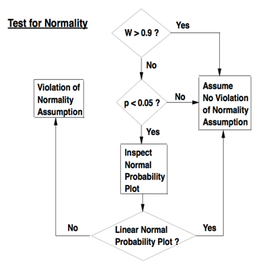

## Intro

**R is an interpreted computer language used primarily for statistical analysis.**

From the [R FAQ](http://cran.rstudio.com/faqs.html):

> R is a system for statistical computation and graphics. It consists of a language plus a run-time environment with graphics, a debugger, access to certain system functions, and the ability to run programs stored in script files.
>
> The design of R has been heavily influenced by two existing languages: Becker, Chambers & Wilks’ S (see [What is S?](http://cran.rstudio.com/doc/FAQ/R-FAQ.html#What-is-S_003f)) and Sussman’s [Scheme](http://www.cs.indiana.edu/scheme-repository/home.html). Whereas the resulting language is very similar in appearance to S, the underlying implementation and semantics are derived from Scheme. See [What are the differences between R and S?](http://cran.rstudio.com/doc/FAQ/R-FAQ.html#What-are-the-differences-between-R-and-S_003f), for further details.
>
> The core of R is an *interpreted computer language* which allows branching and looping as well as modular programming using functions. Most of the user-visible functions in R are written in R. It is possible for the user to interface to procedures written in the C, C++, or FORTRAN languages for efficiency. The R distribution contains functionality for a large number of statistical procedures. Among these are: linear and generalized linear models, nonlinear regression models, time series analysis, classical parametric and nonparametric tests, clustering and smoothing. There is also a large set of functions which provide a flexible graphical environment for creating various kinds of data presentations. Additional modules (“add-on packages”) are available for a variety of specific purposes (see [R Add-On Packages](http://cran.rstudio.com/doc/FAQ/R-FAQ.html#R-Add_002dOn-Packages)).
>
> The name is partly based on the (first) names of the first two R authors (Robert Gentleman and Ross Ihaka), and partly a play on the name of the Bell Labs language ‘S’, which stood for System.”

- Read the [R FAQ](https://cran.rstudio.com/faqs.html). *GNU General Public License.*
- [R documentation](https://www.rdocumentation.org/) provides a comprehensive listing of R packages that are available in CRAN, BioConductor and GitHub.

## Setup

### Installation

- **I highly recommend using a package manager to install R and RStudio.** Otherwise, [R](https://cran.rstudio.com/) and [RStudio](https://www.rstudio.com) must be downloaded and installed separately. R cannot be updated from within RStudio, and installing a new R version can require reinstallation of packages. It's difficult to manage.
- I previously used [Anaconda](https://www.anaconda.com/) to manage my Python and R distributions, and now use Homebrew. I switched because Anaconda is a very large installation, and not as flexible or general as Homebrew. Conda and brew are sort of like competing package managers.

<details><summary>Anaconda info</summary>

#### Anaconda <!-- omit in toc -->

- I install Anaconda by [direct download](https://www.anaconda.com/download/). I have also tried installing via Homebrew Cask, but didn't get the correct command prompt or path.
- Anaconda contains the [Conda](https://conda.io/docs/) and [PyPI](https://pypi.python.org/pypi) (pip) package managers. Packages can be installed from `pip`, and will integrate into the Anaconda environment.
- [Conda commands](https://conda.io/docs/commands):
  - Check installed packages with `$ conda list` and `$ pip list`.
  - Find packages with `$ conda search`.
  - Update conda with `$ conda update --prefix <PATH> anaconda`
  - Update packages with `$ conda update --all`

##### Additions to the standard Anaconda install <!-- omit in toc -->

- R and RStudio
  - When I was working with R, I preferred to install R and RStudio via Anaconda for easier version and package management. Otherwise, [R](https://cran.rstudio.com/) and [RStudio](https://www.rstudio.com) must be downloaded and installed separately. R cannot be updated from within RStudio, and installing a new R version can require reinstallation of packages. It's just too difficult to manage.

    ```shell
    $ conda install -c r r-essentials
    $ conda install rstudio
    ```

</details>

#### Homebrew

- Install [Homebrew](https://brew.sh/). Homebrew includes [Homebrew-Cask](https://caskroom.github.io/) to manage other macOS applications.
- Install R and RStudio

  ```sh
  brew install r
  brew cask install rstudio
  ```

- Update Homebrew regularly with `brew update` and `brew upgrade`
- Check health of installation with `brew doctor`
- See [docs](https://docs.brew.sh) for further info.

### My RStudio setup

- Modern RStudio theme
- Material editor theme
- [Dank Mono](https://dank.sh) font
- In R Markdown options, check "Show document outline by default."
- Information on other RStudio options can be found in the [RStudio documentation](https://support.rstudio.com/hc/en-us/articles/200549016-Customizing-RStudio).

### R Packages

- Packages are programs written for R that provide additional functionality. **Dependence on large numbers of packages is a limitation of R.**
- [Packrat](https://rstudio.github.io/packrat/) manages packages locally for each R project, and has really helped address package dependencies. See [R-reproducibility.rmd](R-reproducibility.rmd).

[back to top](#top)

### General R resources

- **[R in Action](https://www.manning.com/books/r-in-action-second-edition)** by Robert Kabacoff is an excellent reference guide. If I had to recommend one single resource, I would direct you here. Second edition *copyright 2015 by Manning Publications Co. All rights reserved.*
- [Quick-R](http://www.statmethods.net/) by Robert Kabacoff. Great quick reference. *Copyright Robert I. Kabacoff, PhD.*
- [Cookbook for R](http://www.cookbook-r.com/) by Winston Chang. *CC BY-SA 3.0 license (freely shared and adaptable)*
- [R Graphics Cookbook](http://proquest.safaribooksonline.com/book/programming/r/9781449363086) by Winston Chang (mostly for ggplot2). *CC0 1.0 license (public domain dedication, no copyright).*
- [The R book](https://www.amazon.com/R-Book-Michael-J-Crawley/dp/0470973927) by Crawley
- [simpleR PDF by Verzani](https://cran.r-project.org/doc/contrib/Verzani-SimpleR.pdf). *Copyright John Verzani, 2001-2. All rights reserved.- This book is frequently referenced, but outdated ("Appendix: Teaching Tricks" recommends distributing R code to students on "floppies.")
- [Linear models in R](https://www.amazon.com/Linear-Models-Chapman-Statistical-Science/dp/1439887330/ref=dp_ob_title_bk) by Faraway. *Copyright 2014 by Taylor & Francis Group, LLC.*

[back to top](#top)

### Coding practice

**Hands-on coding practice is essential.**

- Read [An Introduction to R](http://cran.rstudio.com/manuals.html) and complete the sample session in Appendix A.
- [DataCamp](https://www.datacamp.com/courses/introduction-to-r) is extremely helpful. I took the “Introduction to R,” “Data Analysis and Statistical Inference,” and “A hands-on introduction to statistics with R track-introductory” courses.

[back to top](#top)

### Editing and executing code

See [RStudio documentation](https://support.rstudio.com/hc/en-us/articles/200484448-Editing-and-Executing-Code)

### Saving code

- Create an **R file** (.R) to compile multiple lines of code and save for future use.
- Create an **R Markdown file** in RStudio to combine notes and functional code.
- **RStudio projects** make it straightforward to divide your work into multiple contexts, each with their own working directory, workspace, history, and source documents. Installing packages into the project locally with Packrat is very helpful.

### Running code

- The basic code entry window is called the **console**. It is oriented towards entering and running code one line at a time, and does not allow you to save the code.
- In the RStudio source editor, to execute a single line of source code where the cursor currently resides use `Cmd+Enter` (or use the **Run** toolbar button).
- There are three ways to execute multiple lines from within the editor:
  1. Select the lines and press `Cmd+Enter` (or use the **Run** toolbar button)
  2. After executing a selection of code, use the **Re-Run Previous Region** command (or its associated toolbar button) to run the same selection again. Note that changes to the selection including additional, removal, and modification of lines will be reflected in this subsequent run of the selection.
  3. To run the entire document press `Cmd+option+R` (or use the **Source** toolbar button). Using the **Knit** command in RMarkdown documents will run the entire document.
- The difference between running lines from a selection and invoking **Source** is that when running a selection all lines are inserted directly into the console whereas for **Source** the file is saved to a temporary location and then sourced into the console from there (thereby creating less clutter in the console).
- **Source on save: Enabling source on save runs the code every time you save.** When editing re-usable functions (as opposed to freestanding lines of R) you may wish to set the Source on Save option for the document (available on the toolbar next to the Save icon). Enabling this option will cause the file to automatically be sourced into the global environment every time it is saved. Setting Source on Save ensures that the copy of a function within the global environment is always in sync with its source, and also provides a good way to arrange for frequent syntax checking as you develop a function.
- The **workspace** is your current R working environment and includes imported datasets, vectors, data frames, and other objects.
- Workspace info persists after restarting R. To clear: In RStudio, Session -> Clear Workspace will reset the workspace (shown in the environment tab in RStudio). Click the broom icon in the environment, history and plots tabs to clear individually.

[back to top](#top)

## Basic syntax

- R can be used as a calculator if needed: `5+5`, `5-5`, `(5+5)/2`, etc)
- Use `<-` or `=` to define a **variable** (also called an **object** in other languages like Python). For example, `x <- 42` or `x = 42` set x equal to 42.
- `~` is similar to `=` in Python or SAS or a normal written equation. It means “versus” or “as a function of.”
- Use quotation marks to enter non-numeric values, called "**strings**." Entering `"forty-two"` will treat forty-two as a word. Both single and double quotes can be used, but double quotes are [preferred](http://stat.ethz.ch/R-manual/R-devel/library/base/html/Quotes.html).
- Logical Boolean values are entered with `TRUE` or `T`, and `FALSE` or `F`.
- You can check the data type of a variable by entering `class(variable_name).`
- You can perform mathematical operations on variables, but only if they have a numerical value assigned.
- Print (view data) in R by simply typing the variable name. There is no need to type `print(variable)` like Python or PROC PRINT like in SAS.
- Hit tab when typing a function to call up a list of suggestions with explanations.
- Use `apropos()` to help identify the proper function to use.
- The help function can be called up by typing `?` followed by the command of interest
- The arrow keys can be used to scroll through previous commands (see p.2 of Verzani simpleR PDF)
- R is case-sensitive, so true and TRUE are treated differently.
- **Adding comments or notes to your code:**
  - In RStudio, you can comment and uncomment code using the **Edit -> Comment/Uncomment Lines** menu item (or Cmd+Shift+C).
  - Begin comments with `#`, similar to how you would use a star to begin a note and a semicolon to conclude it in SAS. A note in R will begin after `#` and continue until the end of the line (until you insert a line break with enter).
  - You can also use a semicolon instead of a line break to indicate the end of a command.
  - **Note that in RMarkdown and Markdown, `#` outside of a code block will specify a header.** See the RMarkdown section in [R-reproducibility.rmd](R-reproducibility.rmd).

[back to top](#top)

## Data structures

R vs. SAS from [Quick-R](http://www.statmethods.net/input/index.html):

> Unlike SAS, which has DATA and PROC steps, R has data structures (vectors, matrices, arrays, data frames) that you can operate on through functions that perform statistical analyses and create graphs. In this way, R is similar to PROC IML.

See R in Action 2.2 for further info.

### Vectors

- The vector is a way to store data in R. Vectors are created with the combine function `c()`. Enter values or variable names separated by commas:

  ```r
  Vector_name <- c(45, 6545, 453, 3453, etc)
  ```

- You can also name the elements of a vector, and create a variable with the vector names for ease of use.

  ```r
  names(vector_name) <- c(“name1”, “name2”)
  ```

- Select parts of a vector with brackets. For example, to create a new vector with a specific portion of another vector, type

  ```r
  new_vector_name <- old_vector_name[vector_element]
  ```

- R stores vectors as strings of data. To put the data in table format, use a **data frame** (see below).

### Matrices

From DataCamp introduction to R course:

> In R, a matrix is a collection of elements of the same data type (numeric, character, or logical) arranged into a fixed number of rows and columns. Since you are only working with rows and columns, a matrix is called two-dimensional. You can construct a matrix in R with the matrix function, for example:
>
> ```r
> matrix(1:9, byrow=TRUE, nrow=3)
> ```
>
> The first argument is the collection of elements that R will arrange into the rows and columns of the matrix. Here, we use `1:9` which constructs the vector `c(1,2,3,4,5,6,7,8,9)`. The argument `byrow` indicates that the matrix is filled by the rows. If we want the vector to be filled by the columns, we just place `bycol=TRUE` or `byrow=FALSE`. The third argument`nrow` indicates that the matrix should have three rows.

- You can use vectors to name rows and columns of a matrix, for example:

  ```r
  colnames(star_wars_matrix) <- c("US","non-US");
  rownames(star_wars_matrix) <- c("A New Hope","The Empire Strikes Back","Return of the Jedi")
  ```

- The `rowSums(matrix_name)` and `colSums(matrix_name)` functions will sum the matrix (the first S is capital).
- Use the `cbind()` function to merge vectors and matrices.
- Similar to vectors, use square brackets `[ ]` to select elements from a matrix. Whereas vectors have one dimension, matrices have two dimensions. You should therefore use a comma to separate that which you want to select from the rows from that which you want to select from the columns. For example:
  - `my_matrix[1,2]` first row, second element.
  - `my_matrix[1:3,2:4]` rows 1,2,3 and columns 2,3,4.
  - If you want to select all elements of a row or a column, no number is needed before or after the comma:
    - `my_matrix[,1]` all elements of the first column.
    - `my_matrix[1,]` all elements of the first row.
  - Just like `2*my_matrix` multiplied every element of my_matrix by two, `my_matrix1 - my_matrix2` creates a matrix where each element is the product of the corresponding elements in `my_matrix1` and `my_matrix2`.
- Similar to vectors, the standard operators like `+ - / *` etc. work in an element-wise way on matrices in R. For example: `2*my_matrix` multiplies each element of `my_matrix` by two.

### Factors

**The factor is an R function used to store categorical variables.**

- To create factors in R, use the function `factor()`. First, create a vector that contains the observations to be converted to a factor. For example, `gender_vector` contains the sex of 5 different individuals and `participants_1` contains discrete numbers representing deidentified study participants:

  ```r
  gender_vector = c("Male","Female","Female","Male","Male")
  participants_1 <- c(2,3,5,7,11,13,17)
  ```

- When you first get a data set, you will often notice that it contains factors with specific factor levels. However, sometimes you will want to change the names of these levels for clarity or other reasons. R allows you to do this with the function `levels()`:

  ```r
  levels(factor_vector) <- c("name1","name2",...)
  ```

- To create an **ordered factor**, you have to add two additional arguments:

  ```r
  factor(some_vector,ordered=TRUE,levels=c("Level 1","Level 2"...))
  ```

  - By setting the argument `ordered=TRUE` in the function `factor()`, you indicate that the factor is ordered. With the argument `levels` you give the values of the factor in the correct order:

    ```r
    levels = c("Low","Medium","High")
    ```

Here's an example within a functional R Markdown code block:

```{r}
# Create a vector of temperature observations
temperature_vector <- c("High", "Low", "High", "Low", "Medium")
# Specify that they are ordinal variables with the given levels
factor_temperature_vector <- factor(temperature_vector, order = TRUE, levels = c("Low","Medium","High"))
# Display the vector
factor_temperature_vector
```

### Data frames

`data.frame()`

- **A data frame is a combination of vectors that functions like a spreadsheet within R.**
- Variables are columns, observations are rows.
- Different types of vectors can be combined into a data frame, as long as the vectors have the same length.
- This is also how datasets are organized in SAS.

Example data frame `mtcars`:

```{r}
names(mtcars) # names of columns
head(mtcars)  # first observations
tail(mtcars)  # last observations
str(mtcars)   # structure of data frame
dim(mtcars)   # dimensions
```

- The function `str()` shows you the structure of your dataset. For a data frame it provides:
  - The total number of observations (e.g. 32 car types)
  - The total number of variables (e.g. 11 car features)
  - A full list of variable names (e.g. mpg, cyl ... )
  - The data type of each variable (e.g. num for car features)
  - The first observations.
- Also see Verzani simpleR Appendix: A sample R session for more with the built-in mtcars dataset.

Example from DataCamp Introduction to R course:


- **Remember that a data frame is essentially a combination of vectors.** The DataCamp example above created the data frame in two steps for instructional purposes, but you can usually build this in to the `data.frame` command.
- To create a data frame on planets sorted by decreasing diameter (example from DataCamp):

  ```r
  positions <- order(planets_df$diameter, decreasing=TRUE)
  # apparently this does not order the data yet, for some reason
  largest_first_df <- planets_df[positions,]
  ```

#### Selecting parts of data frames

- Similar to vectors and matrices, select parts of a data frame with square brackets `[ ]` in the form `my_data_frame[rows,columns]`.
  - `my_data_frame[1,2]` selects the second element from the first row in `my_data_frame`.
  - `my_data_frame[1:3,2:4]` selects rows 1,2,3 and columns 2,3,4 in `my_data_frame`.
  - `my_data_frame[1,]` selects all elements of the first row.
- Selecting part of a data frame column:
  - Maybe you want to select only the first 3 elements of the variable `type` from the `planets` data frame.
  - One way to do this is: `planets_df[1:3,1]`. You have to know (or look up) the position of the variable `type`, which gets hard if you have a lot of variables.
  - It is often easier to just make use of the variable name, e.g. `planets_df[1:3,"type"]`.
- Selecting an entire data frame column:
  - If you want to select all elements of the variable `rings`, both `planets_df[,5]` and `planets_df[,"rings"]` work.
  - Use the `$` sign to tell R that it only has to look up all the elements of the variable behind the sign: `data_frame_name$variable_name`. You can combine this with the element section above: `data_frame_name$variable_name[rows]`. Note that you do not need to specify a column because it is already specified by the variable name.
- Selecting parts of a data frame conditionally:
  - The `subset()` function selects a subset of a data frame according to conditions you specify. `subset(data_frame_name, some.condition== “condition”)`. The first argument of `subset()` specifies the dataset for which you want a subset. By adding the second argument, you give R the necessary information and conditions to select the correct subset. Examples:

    ```r
    subset(planets_df, subset=(planets_df$rings == TRUE))
    subset(planets_df, subset=(planets_df$diameter<1))
    very_good = subset(cdc,cdc$genhlth=="very good")
    age_gt50 = subset(cdc,cdc$age>50)
    red_wine <- subset(wine_data, wine_data[, 1]=="Red")
    red_usa <- subset(red_wine_data, red_wine_data$condition == "USA")
    ```

  - The second `subset=` inside the parentheses may not be necessary.
  - Conditions can be used with logical operators `&` and `|`.
    - The `&` is read "and" so that `subset(cdc, cdc$gender == "f" & cdc$age > 30)` will give you the data for women over the age of 30. `under23_and_smoke = subset(cdc,cdc$age<23 & cdc$smoke100==T)` will select respondents who are under the age of 23 and have smoked >100 cigarettes.
    - The`|` character is read "or" so that `subset(cdc, cdc$gender == "f" | cdc$age > 30)` will select people who are women or over the age of 30.
    - In principle, you may use as many "and" and "or" clauses as you like in a subset.

#### Sorting data frames

- Sort data frames with `order()`.
  - `order()` is a function that gives you the position of each element when it is applied on a variable. Let us look at the vector a: `a <- c(100,9,101)`. Now `order(a)` returns 2,1,3. Since 100 is the second largest element of the vector, 9 is the smallest element and 101 is the largest element.
  - Subsequently, `a[order(a)]` will give you the ordered vector 9,100,101, since it first picks the second element of a, then the first and then the last.
- Example from my postdoc Nrf1 proteomics experiments:

  ```r
  # Use this factor command to put the groups in my preferred order, instead of alphabetically.
  Orderedgroups=factor(group, levels = c("lacZ","Nrf1-HA chow","Nrf1-HA chol","Nrf1-HA bort"))
  # Verify desired order of groups
  summary(group)
  #
  ```

  - Make sure you refer to the new sorted variable (`Orderedgroups` in this case) in subsequent code.
- Example: [Reordering columns in a data frame from Cookbook for R](http://www.cookbook-r.com/Manipulating_data/Reordering_the_columns_in_a_data_frame/):

  ```{r}
  # A sample data frame
  data <- read.table(header=TRUE, text='
    id weight   size
    1   20  small
    2   27  large
    3   24 medium
  ')

  # Reorder by column number
  data[c(1,3,2)]

  # Reorder by column name
  data[c("size", "id", "weight")]

  # To actually change the `data` variable, you need to overwrite it with the new info:
  # data <- data[c(1,3,2)]
  ```

  > The above examples index into the data frame by treating it as a list (a data frame is essentially a list of vectors). You can also use matrix-style indexing, as in data[row, col], where row is left blank.

  ```{r}
  data[, c(1,3,2)]
  ```

  > The drawback to matrix indexing is that it gives different results when you specify just one column. In these cases, the returned object is a vector, not a data frame. Because the returned data type isn’t always consistent with matrix indexing, it’s generally safer to use list-style indexing, or the drop=FALSE option:

  ```{r}
  # List-style indexing of one column
  data[2]

  # Matrix-style indexing of one column - drops dimension to become a vector
  data[,2]

  # Matrix-style indexing with drop=FALSE - preserves dimension to remain data frame
  data[, 2, drop=FALSE]
  ```

- [Another example from Stack Overflow](https://stackoverflow.com/questions/1296646/how-to-sort-a-dataframe-by-columns)
  - Create the data frame

    ```{r}
    dd <- data.frame(b = factor(c("Hi", "Med", "Hi", "Low"),
      levels = c("Low", "Med", "Hi"), ordered = TRUE),
      x = c("A", "D", "A", "C"), y = c(8, 3, 9, 9),
      z = c(1, 1, 1, 2))
    dd
    ```

  - Sort the frame by column z (descending) then by column b (ascending).
    - **You don’t have to put `decreasing=TRUE` like the DataCamp examples, you can just put a negative sign before the column name (-z).**
    - > You can use the `order()` function directly without resorting to add-on tools -- see this simpler answer which uses a trick right from the top of the example(order) code:

      ```r
      R <- dd[with(dd, order(-z, b)), ]
      ```

    - > Edit some 2+ years later: It was just asked how to do this by column index. The answer is to simply pass the desired sorting column(s) to the order() function, rather than using the name of the column (and `with()` for easier/more direct access).

      ```r
      R <- dd[ order(-dd[,4], dd[,1]), ]
      ```

#### Merging data frames

- Adding columns
  - To merge two data frames (datasets) horizontally, use the `merge` function. In most cases, you join two data frames by one or more common key variables (i.e., an inner join).

    ```r
    # merge two data frames by ID
    total <- merge(data frameA,data frameB,by="ID")
    # merge two data frames by ID and Country
    total <- merge(data frameA,data frameB,by=c("ID","Country"))
    ```

- Adding rows
  - To join two data frames (datasets) vertically, use the `rbind` function. The two data frames must have the same variables, but they do not have to be in the same order.

    ```r
    total <- rbind(data_frame_A, data_frame_B)
    ```

  - If `data_frame_A` has variables that `data_frame_B` does not, then either:
    - Delete the extra variables in data frameA or
    - Create the additional variables in data frameB and [set them to NA (missing)](http://www.statmethods.net/input/missingdata.html) before joining them with `rbind( )`.

#### Manipulating data frames

- Stack and unstack using the PlantGrowth dataset included with R:

  ```r
  unstack(PlantGrowth)
  ```

  - `Unstack` separates out the groups into a data frame.
- To create a boxplot of the three groups:

  ```r
  boxplot(unstack(PlantGrowth))
  ```

  - General boxplots are made with `boxplot(independent_variable~dependent_variable)`. See the [Plots section](#plots).

### Lists

- A list in R gathers a variety of objects under one name (that is, the name of the list) in an ordered way. These objects can be matrices, vectors, data frames, other lists, etc. The objects do not need to be related to each other.
- To construct a list you use the function `list()`:

  ```r
  my_list <- list(component1, component2...)
  ```

- The arguments to the list function are the list components. To name items in the list: `list(name1=your.component1, name2=component2,…)`

#### Selecting elements from a list

- Lists will often be built out of numerous elements and components. Getting a single element, multiple elements, or a component out of the list is not always straightforward.
- List components can be selected with square brackets as usual, like `list[1]`.
- `length()` returns the total number of components in the list. For example, to identify the last actor in a list of actors in the movie The Shining:

  ```r
  shining_list$actors[length(shining_list$actors)]
  ```

- As with data frames, components can be referenced by name:

  ```r
  shining_list$reviews
  shining_list[["reviews"]]
  ```

#### Adding elements to a list

- The concatenate function `c()` is used to add elements to a list: `c(list1,some.object)`
- If you want to give the new list item a name, you just add this to the function: `c(list1,new.item.name=some.object)`

[back to top](#top)

## Importing data into R

In RStudio, datasets can be loaded from CSV, from web using **Tools -> Import dataset** or by clicking **Import dataset** in the environment pane.

### CSV file

This is one of the best ways to read in a dataset. Note that the file path should be in UNIX format. UNIX file paths have forward slashes, Windows file paths have backslashes (“whacks”).

```r
mydata <- read.table("c:/mydata.csv", header=TRUE, sep=",")
```

- First row contains variable names, comma is separator
- Note the / instead of \ on mswindows systems

There are many other parameters that can be specified when reading in a dataset. See R help.

### Excel file

Export the excel file to a CSV and follow instructions above, or use the xlsx package:

```r
# read in the first worksheet from the workbook myexcel.xlsx
# first row contains variable names
library(xlsx)
mydata <- read.xlsx("c:/myexcel.xlsx", 1)

# read in the worksheet named mysheet
mydata <- read.xlsx("c:/myexcel.xlsx", sheetName = "mysheet")
```

### Website

```r
load(url(“dataset_url”))
# or
Dataset_name=read.table(“dataset_url”)
```

URL must be enclosed in quotes to make it a string.

### APIs

R is less flexible than Python. Accessing Application Programming Interfaces (APIs) is one example of this. [ProgrammableWeb](https://www.programmableweb.com) shared a helpful [guide](https://www.programmableweb.com/news/how-to-access-any-restful-api-using-r-language/how-to/2017/07/21) to accessing APIs with R.

### Manually

- Create vectors with the dataset numbers and then create a data frame with those vectors (see above).
- the `scan()` function can be used to import a vector or list.
- See [R-data](http://cran.rstudio.com/doc/manuals/r-release/R-data.pdf) CRAN document, and Verzani simpleR Appendix: Entering Data into R for more info.

### Cleaning datasets

`na.omit(dataset_name$optional_variable_name)` will omit any missing values (usually labeled “NA”)

### Attaching datasets

```r
attach(dataset_name, options)
```

- Datasets are usually attached so that variables can be named without reference to the original dataset.
- Note that if the code is run repeatedly without detaching the dataset each time, a message in the console will explain that the variables are masked by the previously input variables of the same name.
- You can also detach() the dataset when you are done. Empty parentheses detach all variables in the workspace.
- From R help (article: “Attach Set of R Objects to Search Path”): “By attaching a data frame (or list) to the search path it is possible to refer to the variables in the data frame by their names alone, rather than as components of the data frame (e.g., in the example below, height rather than women$height).”

### Exporting data frames

- Exporting to a delimited text file:

  ```r
  write.table(x, outfile, sep=delimiter, quote=TRUE, na="NA")
  ```

  - Where `x` is the object and `outfile` is the target file. For example, the statement `write.table(mydata, "mydata.txt", sep=",")` would save the dataset `mydata` to a comma-delimited file named mydata.txt in the current working directory. Include a path (for example, `"c:/myprojects/mydata. txt"`) to save the output file elsewhere. Replacing`sep=","` with `sep="\t"` would save the data in a tab-delimited file. By default, strings are enclosed in quotes ("") and missing values are written as `NA`.
- Exporting to an Excel workbook using the xlsx package:

  ```r
  library(xlsx) write.xlsx(x, outfile, col.Names=TRUE, row.names=TRUE, sheetName="Sheet 1", append=FALSE)
  ```

[back to top](#top)

## Statistical models in R

### Helpful resources for statistical modeling

- [R in Action](https://www.manning.com/books/r-in-action-second-edition)
- [R Graphics Cookbook](http://proquest.safaribooksonline.com/book/programming/r/9781449363086) by Winston Chang (from Cookbook for R creator)
- [R-bloggers R tutorial series](https://www.r-bloggers.com/tag/r-tutorial-series/)
- [R documentation](http://www.rdocumentation.org/) and [Quick-R](http://www.statmethods.net/) for reference
- [UCLA IDRE website](http://www.ats.ucla.edu/stat/r/)
- Chapter 11: Statistical Models in R from An Introduction to R
- Linear models in R by Faraway
- The R book by Crawley
- Guidelines for selection of statistical tests from [UCLA](http://www.ats.ucla.edu/stat/mult_pkg/whatstat/choosestat.html) and [University of Alabama](http://bama.ua.edu/~jleeper/627/choosestat.html)

### Types of variables

- Quantitative
  - Interval/continuous: A measured value where the distance between each value is the same (length, width, weight, blood cholesterol level). A subtype of continuous variable that has a true zero value (age, time, temperature in degrees K) is sometimes called a ratio variable.
  - Discrete: having only counted integer values (# cells, # people)

- Qualitative
  - Nominal: also called categorical. Variable with discrete names for levels (color, diet group)
  - Ordinal: variable with names ranked and organized into levels (low/medium/high)
- Also see
  - Stevens SS *Science* 1946, DOI: [10.1126/science.103.2684.677](http://science.sciencemag.org/content/103/2684/677)
  - DataCamp introduction to statistics course lesson 1 video
  - My course notes (not on GitHub)
    - CPSC 440 Lecture Notes Ch 01-03 p.5
    - CPSC 440 lab 1 slide 9
    - PATH 591 Lecture 05 A

### Basic statistics

- Mean: `mean()`
  - Groups of means can be compared with the `by()` function:

    ```r
    by(data_frame_name$variable_name,data_frame_name$other_variable_name,mean)
    ```

- Median: `median()`
- Variance: `variance()`
  - Example: calculating variance manually

    ```r
    # The dataset `data_jordan` is already loaded
    # Calculate the differences with respect to the mean
    diff <- data_jordan$points-mean(data_jordan$points)
    # Calculate the squared differences
    squared_diff <- (data_jordan$points-mean(data_jordan$points))^2
    # Combine all pieces of the puzzle in order to acquire the variance
    variance <- sum(squared_diff)/(length(squared_diff)-1)
    variance
    # Compare your result to the correct solution. You can find the correct solution by calculating it with the `var()` function.
    var(data_jordan$points)

    ```

- Absolute value: `abs(x)`
- Square root: `sqrt(x)`
- Log: `log(x)`
- Computing summary statistics of data subsets: `aggregate(model_formula, data_frame_name, mean)`. This function is useful if you want to calculate means of each group in a dataset.
- Frequency table (to count the number of times each category occurs in a data frame): `table(data_frame_name)`
  - For a specific variable: `table(data_frame_name$variable_name)`
  - The `table` command can also be used to combine multiple vectors of different types into a table:

    ```r
    smokes = c("Y","N","N","Y","N","Y","Y","Y","N","Y")
    amount = c(1,2,2,3,3,1,2,1,3,2)
    table(smokes,amount)
    ```

- Relative frequency table: `table(data_frame_name$variable_name)/number_observations`
- The `summary()` function gives you an overview description of a variable (minimum, first quartile, median, mean, third quartile, and maximum). The `describe()` function is similar, but includes more information on the distribution (sd, range, skew, kurtosis). Remember that skew is classified by the direction of the data tail.
- Using **comparisons** is a good way to facilitate data analysis.
  - To select all elements of a vector that are greater than zero, type `new_vector_name <- vector_name >0`
  - To compare vectors/variables (can also use < or ==):

    ```r
    data_frame_name$variable_name>data_frame_name$other_variable_name
    ```

  - To compare multiple elements of a vector:

    ```r
    vector_name[element1]>vector_name[element2]
    ```

  - To create a ratio:

    ```r
    ratio_name <- data_frame_name$variable_name/data_frame_name$other_variable_name
    ```

  - Proportion:

    ```r
    proportion_name <- data_frame_name$variable_name/(data_frame_name$variable_name+data_frame_name$other_variable_name)
    ```

  - You can calculate a proportion based on a subset of the data. Example:

    ```r
    # In this example, the 'atheism' data frame has already been loaded into the workspace
    # Your code to create the 'us12' subset:
    us12 = subset(atheism, atheism$nationality == "United States" & atheism$year =="2012")
    # Calculate the proportion of atheist responses:
    proportion = nrow(subset(us12,response == 'atheist'))/nrow(us12)
    ```

- Sum vectors with the `sum()` function, and compare sums with `variable_name>other_variable_name`.
- The `scale()` function converts values to z scores.

### Confidence intervals

- 95% confidence for a sample size n means that 95% of random samples of size n will yield confidence intervals that contain the true average value.
- The margin or error is equal to the radius (or half the width) of the confidence interval.
- Sample code:

  ```r
  # Calculate the standard error:
  se = sd(vector_name)/sqrt(# observations)

  # Calculate the lower and upper bounds of your confidence interval and print them:
  lower = sample_mean - 1.96 - se
  upper = sample_mean + 1.96 - se
  c(lower, upper)
  ```

- Calculating the critical value for a confidence interval: `qnorm(0.95)`
- Margin of error:
  - > Imagine you've set out to survey 1000 people on two questions: are you female? and are you left-handed? Since both of these sample proportions were calculated from the same sample size, they should have the same margin of error, right? Wrong! While the margin of error does change with sample size, it is also affected by the proportion.

    ```r
    # The first step is to make a vector p that is a sequence from 0 to 1 with each number separated by 0.01:
    n = 1000
    p = seq(0, 1, 0.01)
    # We then create a vector of the margin of error (me) associated with each of these values of p using the familiar approximate formula (ME = 2 X SE):
    me = 1.96 - sqrt(p - (1 - p)/n)
    # Finally, plot the two vectors against each other to reveal their relationship:
    plot(me ~ p)
    ```

### Probability

- Simulating a coin flip with `sample()`:

  ```r
  outcomes = c("heads", "tails")
  sample(vector_name, size=100, replace=TRUE)
  ```

  - The code above simulates 100 flips of a fair coin.
  - Add different probability with

    ```r
    sample(vector_name, size=100, replace=TRUE,prob=c(0.2,0.8))
    ```

  - The sample can also be saved as a vector for further analysis (such as calculating the mean, or other statistics)

### For loops, bootstrapping, and inference

> "The **for loop** is a cornerstone of computer programming. The idea behind the for loop is **iteration**: it allows you to execute code as many times as you want without having to type out every iteration.

- Example for loop (from DataCamp data analysis and statistical inference course, also see Verzani simpleR p.48):
  - >In this example, we want to iterate the two lines of code inside the curly braces that take a random sample of size 50 from area then save the mean of that sample into the sample means50 vector. Without the for loop, this would be painful:

    ```r
    sample_means50 <- rep(NA, 5000)
    samp <- sample(area, 50)
    sample_means50[1] <- mean(samp)
    samp <- sample(area, 50)
    sample_means50[2] <- mean(samp)
    samp <- sample(area, 50)
    sample_means50[3] <- mean(samp)
    samp <- sample(area, 50)
    sample_means50[4] <- mean(samp)
    ```

    > and so on... With the for loop, these thousands of lines of code are compressed into a handful of lines:

    ```r
    # The 'ames' data frame and 'area' and 'price' objects are already loaded into the workspace
    # Set up an empty vector of 5000 NAs to store sample means:
    sample_means50 = rep(NA, 5000)
    # Take 5000 samples of size 50 of 'area' and store all of them in 'sample_means50'.
    # Also print 'i' (the index counter):
    for (i in 1:5000)
    {
      samp = sample(area, 50)
      sample_means50[i] = mean(samp)
      print(i)
    }
    ```

  - > In the first line we initialize a vector. In this case, we created a vector of 5000 NAs called `sample means50`. This vector will store values generated within the for loop. NA means not available, and in this case they're used as placeholders until we fill in the values with actual sample means. NA is also often used for missing data in R.
  - > The second line calls the for loop itself. The syntax can be loosely read as, "for every element `i` from 1 to 5000, run the following lines of code". You can think of `i` as the counter that keeps track of which loop you're on. Therefore, more precisely, the loop will run once when `i`=1, then once when `i`=2, and so on up to `i`=5000.
  - > The body of the for loop is the part inside the curly braces, and this set of code is run for each value of `i`. Here, on every loop, we take a random sample of size 50 from `area` (note: the sample size can be previously defined by creating a vector), take its mean, and store it as the ith element of `sample_means50`. In order to display that this is really happening, we asked R to print `i` at each iteration. This line of code is optional and is only used for displaying what's going on while the for loop is running.
  - > The for loop allows us to not just run the code 5000 times, but to neatly package the results, element by element, into the empty vector that we initialized at the outset.
  - > You can also run multiple distributions through the same for loop:

    ```r
    # The 'ames' data frame and 'area' and 'price' objects are already loaded into the workspace

    # Initialize the sample distributions:
    sample_means10 = rep(NA, 5000)
    sample_means100 = rep(NA, 5000)

    # Run the for loop:
    for (i in 1:5000) {
      samp = sample(area, 10)
      sample_means10[i] = mean(samp)
      samp = sample(area, 100)
      sample_means100[i] = mean(samp)
    }
    ```

  - > Don't worry about the fact that `samp` is used for the name of two different objects. In the second command of the for loop, the mean of `samp` is saved to the relevant place in the vector `sample_means10`. With the mean saved, we're now free to overwrite the object samp with a new sample, this time of size 100. In general, anytime you create an object using a name that is already in use, the old object will get replaced with the new one, i.e. R will write over the existing object with the new one, which is something you want to be careful about if you don't intend to do so."

- > Another example: Obtain a random sample, calculate the sample's mean and standard deviation, use these statistics to calculate a confidence interval, repeat steps (1)-(3) 50 times.

  ```r
  # The 'ames' data frame is already loaded into the workspace

  # Initialize 'samp_mean', 'samp_sd' and 'n':
  samp_mean = rep(NA, 50)
  samp_sd = rep(NA, 50)
  n = 60

  # For loop goes here:
  for (i in 1:50)
  {
    samp = sample(population, n)
    samp_mean[i] = mean(samp)
    samp_sd[i] = sd(samp)
  }
  ```

- For loops can also be used for **bootstrapping**.
  - Bootstrapping is a way of amplifying your data for estimation.
  - Definition (from Google):
    - > a technique of loading a program into a computer by means of a few initial instructions that enable the introduction of the rest of the program from an input device.
  - There is also a `boot` package available for R
  - **Sampling vs. bootstrapping: The sampling distribution is calculated by resampling from the population, the bootstrap distribution is calculated by resampling from the sample.**
  - Example: bootstrap confidence interval for the average weight gained by all mothers during pregnancy. (From Datacamp data analysis and statistical inference course lab 4)

    ```r
    # The 'nc' data frame is already loaded into the workspace

    # Initialize the 'boot_means' object:
    boot_means=rep(NA,100)

    # Insert your for loop:
    for (i in 1:100) {
      boot_sample = sample(gained_clean, n, replace=T)
      boot_means[i] = mean(boot_sample)
    }

    # Make a histogram of 'boot_means':
    hist(boot_means)
    ```

#### The inference function

- Writing a for loop every time you want to calculate a bootstrap interval or run a randomization test is cumbersome. This is a custom function that automates the process. By default the `inference` function takes 10,000 bootstrap samples (instead of the 100 you’ve taken above), creates a bootstrap distribution, and calculates the confidence interval, using the percentile method.
- Example

  ```r
  # The 'nc' data frame is already loaded into the workspace
  # Load the 'inference' function:
  load(url("http://s3.amazonaws.com/assets.datacamp.com/course/dasi/inference.Rdata"))

  # Run the inference function:
  inference(nc$gained, type="ci", method="simulation", conflevel=0.9, est="mean", boot_method="perc")

  ```

  - `method=“se”` will perform the method based on the standard error
  - `est=“median”` will create an interval for the median instead of the mean

- Example *(Datacamp data analysis and statistical inference course lab 4)*:
  - > use the inference function for evaluating whether there is a difference between the average birth weights of babies born to smoker and non-smoker mothers:

    ```r
    # The 'nc' data frame is already loaded into the workspace
    # The code: inference(y = nc$weight, x = nc$habit, est = "mean", type = "ci", null = 0, alternative = "twosided", method = "theoretical",order=c("smoker","nonsmoker"))
    ```
  - > The first argument is y, which is the response variable that we are interested in: `nc$weight`.
  - > The second argument is the grouping variable `x`, which is the explanatory variable multiplied by the grouping variable across the levels of which we’re comparing the average value for the response variable, smokers and non-smokers: `nc$habit`.
  - > The third argument `est` is the parameter we’re interested in: "mean" (other options are "median", or "proportion".)
  - > Next we decide on the type of inference we want: a hypothesis test ("ht") or a confidence interval("ci").
  - > When performing a hypothesis test, we also need to supply the null value, which in this case is 0, since the null hypothesis sets the two population means equal to each other.
  - > The alternative hypothesis can be "less", "greater", or "twosided".
  - > The method of inference can be "theoretical" or "simulation" based.
  - > The order function changes the order of the variable levels.
  - > You can also add `success=`, which defines a success for survey data-type questions.
- > Another example: Take a subset `spain` of `atheism` with only the respondents from Spain. Calculate the proportion of atheists within this subset. Use the `inference` function on this subset, grouping them by year. *(From Datacamp data analysis and statistical inference course lab 4)*

  ```r
  # Take the 'spain' subset:
  spain = subset(atheism, atheism$nationality == "Spain")
  # Calculate the proportion of atheists from the 'spain' subset:
  proportion = nrow(subset(spain,response == 'atheist'))/nrow(spain)
  # Use the inference function:
  inference(spain$response, spain$year, est = "proportion", type = "ci", method = "theoretical", success = "atheist")
  ```

### Fisher's exact test

- Useful when both dependent and independent variables are categorical, or when dependent variable is a count.
- It evaluates the association, or contingency, between two kinds of classifications.
- Data must first be put into a contingency table:

  ```r
  table_name <- xtabs(formula, data=data_frame_name)
  ```

- Next, run the test and reference the table

  ```r
  fisher.test(mytable)
  ```

- See R in action ch. 7.2, Crawley The R Book ch. 14-15, [UCSC R tips](http://www.pmc.ucsc.edu/~mclapham/Rtips/categorical.htm).
- Example from my grad school lab: Prostate cancer incidence data from TRAMP Tomato Soy paper
  - Zuniga KE, Clinton SK, Erdman JW. The interactions of dietary tomato powder and soy germ on prostate carcinogenesis in the TRAMP model. *Cancer Prev. Res.* (2013). DOI: [10.1158/1940-6207.CAPR-12-0443](https://doi.org/10.1158/1940-6207.CAPR-12-0443)
  - Code located in [R-sample-code/fishers-exact](https://github.com/br3ndonland/R-sample-code/fishers-exact).

### T-test

```r
t.test(y~x, var.equal = TRUE)
t.test(y1,y2, var.equal = TRUE) # when both variables are numeric
t.test(y,mu=2, var.equal = TRUE) # one-sample t-test, with null hypothesis mean mu=3.
t.test(y~x, paired=TRUE, var.equal = TRUE) # paired t-test
t.test(y~x, alternative = "less", var.equal = TRUE) # one-tailed t-test
t.test(y~x, alternative = "greater", var.equal = TRUE) # one-tailed t-test
```

- Default t-test assumes heterogeneity of variance and applies a Welch/Satterthwaite df modification. Include `var.equal = TRUE` to indicate homogeneity of variance.
- [Nonparametric](http://www.statmethods.net/stats/nonparametric.html) and [resampling](http://www.statmethods.net/stats/resampling.html) alternatives to t-tests are available.
- Also see
  - [Quick-R](http://www.statmethods.net/stats/ttest.html)
  - Verzani simpleR p.63
  - [T-tests Columbia](http://www.stat.columbia.edu/~martin/W2024/R2.pdf)
  - CPSC 440 ch 6 lecture p.16, CPSC 440 lab 07 notes p.5 (not available on GitHub).

#### Assumptions

1. **Normality**

  - Shapiro-Wilk W test (W>0.9 desired, see flowchart from PATH 591 lecture 03 p.11 in linear regression section):

    ```r
    shapiro.test(dependent_variable_name, options)
    ```

  - Normal quantile-quantile plot

    ```r
    qqnorm(dependent_variable_name, options)
    qqline(dependent_variable_name, options)
    ```

    - Note that ggplot2 does not have features for easy creation of q-q plots.

2. **Equality of variances**

  ```r
  var.test(dependent_variable~independent_variable)
  ```

  - This is identical to the method used in SAS proc ttest, and simply divides one variance by the other.
  - As explained above, if variances are not equal, the Welch/Satterthwaite modification should be used.

### Linear regression

*See R in action ch.8.*

#### Model syntax and functions

  ```r
  model.name <- lm(model, data, ...)
  ```

See R in Action tables 8.2 and 8.3 for full syntax info.

<html>
<head>
<style>
table {
  font-family: calibri;
  border-collapse: collapse;
  width: 100%;
}

td, th {
  border: 1px solid #dddddd;
  text-align: left;
  padding: 10px;
}

tr:nth-child(even) {
  background-color: #dddddd;
}
</style>

<th> Linear regression formula symbols. Adapted from R in Action, HTML formatting by Brendon Smith.
</head>

<body>

<table>

  <tr>
  <th>Symbol</th>
  <th>Function</th>
  </tr>
  <tr>
  <th>~</th>
  <th>dependent variable on left, independent variables on right, like `y~a+b`</th>
  </tr>
  <tr>
  <th>+</th>
  <th>separates independent variables.</th>
  </tr>
  <tr>
  <th>:</th>
  <th>interaction, such as `y~a:b`, meaning interaction of independent variables a and b.</th>
  </tr>
  <tr>
  <th>*</th>
  <th>all possible combinations of the variables.</th>
  </tr>
  <tr>
  <th>^</th>
  <th>restricts interactions to a certain degree. The formula `y ~ (a + b + c)^2` would be read by R as y ~ a + b + c + a:b + a:c + b:c.</th>
  </tr>
  <tr>
  <th>.</th>
  <th>references all independent variables in the data frame.</th>
  </tr>
  <tr>
  <th>-</th>
  <th>subtracts a variable from the model.</th>
  </tr>
  <tr>
  <th>-1</th>
  <th>Suppresses the intercept.</th>
  </tr>
  <tr>
  <th>I()</th>
  <th>allows use of arithmetic within the parentheses.</th>
  </tr>
</table>

</body>
</html>

<html>
<head>
<style>
table {
  font-family: calibri;
  border-collapse: collapse;
  width: 100%;
}

td, th {
  border: 1px solid #dddddd;
  text-align: left;
  padding: 10px;
}

tr:nth-child(even) {
  background-color: #dddddd;
}
</style>

<th> Linear regression functions that can be used after specifying the model. Adapted from R in Action, HTML formatting by Brendon Smith.
</head>

<body>

<table>

  <tr>
  <th>Function</th>
  <th>Action</th>
  </tr>
  <th>`aic()` or `bic()`</th>
  <th>Prints Aikake's or Bayes' Information Criterion.</th>
  </tr>
  <tr>
  <th>`anova()`</th>
  <th>anova table</th>
  </tr>
  <tr>
  <th>`coefficients()`</th>
  <th>Shows intercept and slopes for the regression model.</th>
  </tr>
  <tr>
  <th>`confint()`</th>
  <th>Confidence intervals (95 percent by default).</th>
  </tr>
  <tr>
  <th>`fitted()`</th>
  <th>Lists predicted values.</th>
  </tr>
  <tr>
  <th>`plot()`</th>
  <th>plots for evaluating model fit. *To select specific plots, add “which=”.*</th>
  </tr>
  <tr>
  <th>`residuals()`</th>
  <th>Residuals are basically the deviation from the model fit. See <a href="https://www.dropbox.com/s/5unmjqfne3ht3d0/PATH%20591%20Lecture%2003%20-BasicsLinearRegression-2012%20with%20notes.pdf?dl=0">PATH 591 lecture 03</a> for a clear visual explanation of residuals. Use `rstandard()` for standardized residuals (divided by standard deviation, fitted including the current data point), `rstudent()` for studentized residuals (divided by standard deviation, but fitted ignoring the current data point). `Stdres()` and `studres()` can also be used but require the MASS package (Modern Applied Statistics with S).*</th>
  </tr>
  <tr>
  <th>`summary()`</th>
  <th>Summary of the regression model. *To view a specific part, such as just the R^2^, add `$r.squared` or `$adj.r.squared`*</th>
  </tr>
  <tr>
  <th>`vcov()`</th>
  <th>Lists the covariance matrix for model parameters.</th>
  </tr>
</table>

</body>
</html>

#### Selection of regression models

- Begin with full model
- Hierarchical elimination of variables in multiple linear regression: eliminate non-significant variables from the full model, or until there is no further improvement in the adjusted r^2^.
- Information criteria, such as Akaike’s Information Criterion (AIC) or Bayes Information Criterion (BIC), can be used to select models and covariance stuctures. These criteria rate linear models based on fit and model size. The model with the lowest AIC and/or BIC has the best balance between fit and model size.
- Further information:
  - R in Action 8.6
  - Linear Models with R 8.3
  - CPSC 542 Lecture 10 pp. 4-7 (not available on GitHub)

#### Linear Regression Assumptions

1. **Normality of residuals**
  - Shapiro-Wilk W statistic: based on mathematics of normal probability plots. Compares variance of distribution to variance expected under normal distribution. Shapiro-Wilk W statistic trumps p value.

    

    - **Make sure you are testing residuals and not raw data.** It is acceptable to test normality using **studentized residuals**.
    - See SAS for mixed models section 10.2.3 p.418, and "Linear Mixed Models: A Practical Guide Using Statistical Software" by West Welch and Galecki p.105.
  - Graphical evaluation by normal quantile-quantile plot
  - Skewness: measure of asymmetry in distribution. A perfect normal distribution has skewness=0. Positively skewed distributions=tail to the right, negatively skewed=tail to the left.
  - Kurtosis: another measure of asymmetry in distribution. Leptokurtic distributions (kurtosis<0) will have more observations at the center, platykurtic distributions (kurtosis>0) are spread evenly.

2. **Independence of residuals**
  - Serial correlation: Durbin-Watson D. Found in the `car` and `lmtest` packages. Use `acf(lm_name$residuals)`, `acf(rstudent(lm_name))`, or `acf(studres(lm_name))`. `studres` (in the MASS package) will produce an autocorrelation plot. The dashed lines indicate the 95% confidence interval, and correlations ideally lie within the lines.

3. **Homogeneity of residual variances**
  - Plots of residuals vs. fitted/predicted values, residuals vs. any independent variable (dot or box plots); absolute value or square root of absolute value of residuals vs. fitted values. Plots of residuals vs predicted values in datasets with HOV would look like a cloud/ball with no correlation. If the plot looks like a megaphone, it suggests a missing term in the model (see "strategies to address model violations" below), or the need to use an unstructured covariance model.
  - Residuals should also sum to zero
  - Spearman rank order correlation between the absolute values of the residuals and the predicted values
  - See below under "Variance assessment for multivariate, factorial, and repeated measures designs" for information on how to assess HOV in complex designs using fit statistics like aic() and bic().

4. **Linearity and additivity** of the relationship between dependent and independent variables. Assessed with graphical evaluation by plot of residuals vs predicted values.

5. **Influential observations**
  - Cook’s D is a distance statistic that measures change in regression parameter estimates when an observation is deleted.
    - Cook’s D values are sometimes compared with a critical F value F~0.50~(k,n-k-1) (see PATH 591 lecture 03 p.15, not available on GitHub).
    - According to R in Action 8.4.3, Cook’s D values greater than 4/(n-k-1), where n is the sample size and k is the number of predictor variables, indicate influential observations, but 1 can also be an appropriate cutoff.
  - A Bonferroni outlier test can also be performed with the `outlierTest()` function in the `car` package.
  - Plots of Cook’s D values and residuals vs leverage allow graphical assessment of influential observations. Add a critical line to the Cook’s Distance plot with:

    ```r
    cookscritical <- 4/(nrow(dataframe)-length(lm1$coefficients)-2)
    plot(lmlog, which=4, cook.levels=cookscritical)
    abline(h=cookscritical, lty=2, col="red")
    ```

#### Global validation of linear model assumptions with the `gvlma` package

- This is a new and improved approach to validating the assumptions of linear models.
  - Normally, individual tests for specific assumptions are performed. This increases the type I error rate and masks combinatorial effects of multiple assumption violations (results of one assumption test may be impacted by violations of other assumptions).
  - Assessment by graphical methods is subjective.
  - gvlma provides an integrated global test of all four major assumptions (normality of residuals, independence of residuals, homogeneity of residual variances, linearity) that controls type I error rate, and also provides several plots.
- `gvlma` returns five summary values:
  1. Global stat: combination of the statistics for skewness, kurtosis, link function, and heteroscedasticity, representing the global test of all model assumptions.
  2. Skewness
  3. Kurtosis
  4. Link Function: the link function is a feature of all linear models that links the linear model to the mean of the response variable. “Identity” is the link function for a normal distribution. A misspecified link function, meaning that the link function does not match the distribution of the data, will result in a large and significant value for this statistic.
  5. Heteroscedasticity: tests the assumption of homogeneity of residual variances.
- Further information:
  - Peña EA, Slate EH. Global Validation of Linear Model Assumptions. *J. Am. Stat. Assoc.- 101:341 (2006).
  - R in Action 8.3, 13, and [Quick-R regression diagnostics](http://www.statmethods.net/stats/rdiagnostics.html).
  - PATH 591 lecture 03 (not available on GitHub)

#### Strategies for addressing model violations

- Addition of variables to the model to account for residual variance
- Transformation of independent or dependent variable
  - Normalizing transformations (+1 used to avoid undefined values for zeros, log(0+1)=1)
    - Log: log(y+1) (usually log10 but can also be log2 or loge/ln)
    - Square root:
    - Reciprocal: 1/(y+1) (particularly effective at reducing skewness)
    - See PATH 591 lecture 03 pp.11-15 (not available on GitHub).
  - Variance-stabilizing transformations
    - Square root, log, reciprocal (in order of increasing heterogeneity of variance)
  - Linearizing transformations for curvilinear relationships
    - Exponential function: linearized by log transformation of y
    - Logarithmic function: linearized by log transformation of x
    - Power function: linearized by log transformation of both x and y
    - See PATH 591 lecture 04 C (not available on GitHub)
  - Arcsin(y) can correct non-normality or heteroscedasticity for variables that are proportions (1-100%). See PATH 591 problem set 4 (not available on GitHub).
  - The independent variable can also be transformed if it is continuous. Categorical independent variables should not be transformed.
- The Spearman rank order correlation between the independent and dependent variable is another type of correlation that is more widely valid, especially in situations where F test assumptions are violated.
- Curvilinearity in a plot of resids vs. preds can be addressed by fitting a polynomial regression function.
- **It is not appropriate to simply throw out influential data points unless they are due to measurement error or some other problem.**
- Weighted least squares regression can be used to address serial correlation or influential observations. See PATH 591 lecture 03 p.14 (not available on GitHub). It allows influential observations to be re-weighted to minimize interference with the model. SAS provides a “reweight” statement for this purpose.
- Link function violations: as with violations of other assumptions, transformation of the data set, addition of variables to the model, or use of a different model may be necessary. Different link functions, such as binomial or Poisson, can usually be specified with a generalized linear mixed models approach. If a simple correlation is desired, the Spearman test can be used instead.

#### Reporting regression results

```text
F~0.05~(k, n-1 df)=, r^2^, p<
```

This information is usually adequate for publication purposes. See PATH 591 lecture 4a p.8(not available on GitHub).

### ANOVA

**ANOVA is a type of linear regression analysis with categorical independent variables.** R in Action ch.9 contains an excellent section on ANOVA.

#### ANOVA model syntax and functions

**Options for basic ANOVA:**

  1. `aov(model, data=data.frame)`
  2. `lm()`
   `anova()`
  3. `glm()`

*See R in Action table 9.5 for more syntax info and model examples.*

- Model syntax is similar to linear regression model syntax.
- **A regression approach with the `lm()` function is more flexible than a basic ANOVA analysis with the `aov()` function.** It allows inclusion of both categorical and quantitative independent variables and enables prediction.
- The `aov()` function uses Type I sums of squares, which is not appropriate for imbalanced designs (groups of different sizes). The `Anova()` function (with a capital A) in the `car` package allows use of Type II or III sums of squares.
- The order of terms in the model can sometimes influence the result in certain situations, such as imbalanced designs and designs including covariates. It may also depend on how the variance is partitioned (Type I-III sums of squares). See [CRAN 7.18](https://cran.r-project.org/doc/FAQ/R-FAQ.html#Why-does-the-output-from-anova_0028_0029-depend-on-the-order-of-factors-in-the-model_003f).
  - Note on Type III sums of squares from Muenchen R for SAS and SPSS users 23.12 p.431:
    > The R community has a very strongly held belief that tests based on partial sums of squares can be misleading. One problem with them is that they test the main effect after supposedly partialing out significant interactions. In many circumstances, that does not make much sense. See the paper, [Exegesis on Linear Models](http://www.stats.ox.ac.uk/pub/MASS3/Exegeses.pdf), by W.N. Venables, for details [39].
- `glm()` uses iteratively reweighted least squares (IWLS). *Further information in R in Action chapter 13.*
- If the model contains categorical variables with >2 levels, R creates ‘indicator’ or dummy variables for each level.

#### ANOVA Assumptions

1. **Normality of residuals**
  - Shapiro-Wilk W test (W>0.9 desired, see flowchart from PATH 591 lecture 03 p.11 in linear regression section):

    ```r
    shapiro.test(dependent_variable_name, options)
    ```

  - Normal quantile-quantile plot

    ```r
    qqnorm(dependent_variable_name, options)
    qqline(dependent_variable_name, options)
    ```

2. **Homogeneity of residual variances**
  - Bartlett test: `bartlett.test()`. Bartlett test is sensitive to deviations from normality.
  - Levene test

    ```r
    # Download and install the car package first
    library(car)
    leveneTest(y~a, location= “mean”)
    ```

  - Brown-Forsythe test

    ```r
    # Download and install the car package first
    library(car)
    leveneTest(y~a)
    ```

    - The Brown-Forsythe test evaluates deviations from group medians, and thus is robust to violations of normality.

  - **These HOV tests are only appropriate for one-way designs. A different approach is required for more complex designs.**
  - **Factorial designs** can be converted to one-way by splitting each treatment combination into a separate group and identifying it as a single level in one independent variable, calling the one new independent variable “treatment,” and then performing the Brown-Forsythe test. This does not work for repeated measures data because values for each group at one timepoint are correlated to values at other timepoints.
  - **Variance assessment for multivariate, factorial, and repeated measures designs**
    - Graphical assessment as described for linear regression above:
      - Plot of residuals vs predicted values
      - Plot of residuals vs independent variables (dot or box plots)
    - Numerical assessment using fit statistics
      - *I am more familiar with this in SAS. Explanation below.*
      - In general, you want to use the simplest model possible that minimizes AIC, AICC, and BIC while still meeting the assumptions of the model. Mind the assumptions of each covariance structure. See CPSC 542 Lecture 10 pp. 4-7 (not available on GitHub).
      - Dr. Bullock (Illinois CPSC statistics professor):
        > You select an error structure with heterogeneous variances [like unstructured] and compare that to a model with everything the same with the exception of homogeneous variances [like compound symmetry]. The differences in the log likelihoods will be a chi-square with degrees of freedom equal to the differences in the number of estimates in the two models.
        - This is also described in the Littell “SAS for mixed models” text p. 172.
        - In other words, run the code using the unstructured model, and copy/paste the “Fit Statistics” table and the number of covariance parameter estimates into Excel. The number of estimates (also called covariance parameters) is given under “Dimensions” in the output. Also look at the “-2 Res Log Likelihood” number under “Fit Statistics” in the output. Then run the code several more times, using different covariance structures each time (cs, ar(1), arh(1), toep, and toeph), and paste the fit statistics and estimates into excel also. Then, for each test other than unstructured, type =chidist(x, df), using the difference between the “-2 Res Log Likelihood” for unstructured and the other test as the “x” or chi square, and the difference in #parameters between unstructured and the other test as the df. The answer will be a p value. A significant p indicates that the unstructured model provides superior fit.
3. **Independence of residuals** is required. Any pairing in the data, such as in repeated measures designs, must be appropriately specified in the model.

#### ANOVA Multiple comparisons

##### All pairwise comparisons

```r
TukeyHSD(model)
pairwise.t.test(y, a) # note that this is adjusted for multiple comparisons
```

or

```r
library(multcomp)
library(RColorBrewer) # load RColorBrewer for additional color palettes.
tuk <- glht(aov1, linfct=mcp(variable_name="Tukey"))
cld(tuk)
plot(cld(tuk, level=.05), col=brewer.pal(8,"Pastel1")) # "I'm a very vivacious man... Earth tones are so passe. I'm a pastel man."
```

##### Specific pairwise comparisons with contrasts and estimates

- This is similar to the estimate capability in SAS PROC MIXED and GLIMMIX. Also see R in Action 9.4, Linear Models with R p.180.
  - Download and install the `multcomp` package.
  - First, print the covariance matrix with `model.matrix(model_name)` to identify coefficients for contrasts.

    ```r
    library(multcomp)
    contrast <- rbind("contrast name" = c(3, -1, -1, -1))
    # numbers from error matrix to indicate group comparisons
    summary(glht(model_name, linfct=mcp(x=contrast)))
    ```

#### ANOVA Interaction effects

Options for creation of interaction plots:

```r
interaction.plot(variable1, variable2, options)
```

```r
library(effects)
plot(effect(factorial_term, model_name, xlevels), multiline=TRUE)
```

```r
library(gplots) plotmeans(y ~ interaction(variable1, variable2, sep=" "), connect=list(c(1,3,5),c(2,4,6)), col=c("red", "darkgreen"), main = "Interaction Plot with 95% CIs", xlab="Treatment and Dose Combination")
```

```r
library(HH)
interaction2wt(model)
```

#### Covariates and repeated measures

Using `aov()` or `lm()` is the simplest method, but also the least flexible. It assumes sphericity, and thus is not suitable for most real-world datasets. A mixed models approach is required to appropriately model covariance. R in Action does not cover mixed models in depth.

A few options:

- `Anova()` in the `car` package
- `lmer()` in the `lme4` package. See [CRAN 7.35](https://stat.ethz.ch/pipermail/r-help/2006-May/094765.html) for discussion of p values in this function.
- `lme()` or `gls()` in the `nlme` package

**Analysis of covariance includes both fixed effects (independent variables) and random effects (covariates included to model random variation). If the effect can be reproduced, it's fixed.** With fixed effects you are interested in the means, but with random effects you are interested in variances. Blocks could be either fixed or random; for example, if you are doing a test on trees and you want to block for forest, setting blocks as random would indicate that you want to block for just all forests everywhere in general and these forests are representative of all forests, whereas setting blocks as fixed would indicate that you want to block for these specific forests you’re evaluating. See CPSC 440 lecture notes ch 08 ANOVA (not available on GitHub).

**The covariance structure must be appropriately specified.** Fit statistics and information criteria can be used to identify an appropriate covariance structure: `AIC(model)`. See “Selection of regression models” in the Linear regression section, and "Variance assessment for multivariate, factorial, and repeated measures designs" in the ANOVA section above.

### Wilcoxon rank-sum

```r
wilcox.test(y~x, data)
```

- Also known as the Mann-Whitney U test
- Used to compare two non-parametric independent samples
- Note that, although the Wilcoxon rank sum test does not require normality, it does require homogeneity of variances and independence of random samples.
- See R in Action 7.5

### Wilcoxon signed rank

```r
wilcox.test(y~x, data, paired=TRUE)
```

- Used to compare two non-parametric paired samples
- See R in Action 7.5, Verzani simpleR p.67

### Kruskal-Wallis

```r
kruskal_test(y~a, data)
```

Non-parametric one-way ANOVA, where `y` is a dependent variable and `a` is a categorical independent variable with ≥2 levels.

#### Multiple comparisons after Kruskal-Wallis testing

Pairwise Wilcoxon testing:

```r
pairwise.wilcox.test(y, x, p.adjust.method= “holm”)
```

- This function allows control of the experiment-wide error rate and is the best non-parametric multiple comparisons method available in R.
- Adjustment options:
  - `holm`
  - `hochberg`
  - `hommel`
  - `bonferroni`
  - `BH`
  - `BY`
  - `fdr`
  - `none`
- From R Documentation:
  > The first four methods are designed to give strong control of the family-wise error rate. There seems no reason to use the unmodified Bonferroni correction because it is dominated by Holm's method, which is also valid under arbitrary assumptions.”

Nemenyi test

```r
library(PMCMR)
posthoc.kruskal.nemenyi.test(y, x, method= c(“Tukey”, “Chisq”))
```

- Requires the `pmcmr` package (Pairwise Multiple Comparisons of Mean Rank Sums)

`nparcomp`

```r
library(nparcomp)
nparcomp(y~a, data, type=)

```

- Requires the nparcomp package.

`npmc`: there used to be an npmc package that is referred to in some documentation. It is no longer maintained.

#### Kruskal-Wallis Assumptions

1. **Normality**: These data fail the assumption of normality, and are not amenable to transformation, hence the use of non-parametric testing. It is still worthwhile to perform the usual normality testing to demonstrate this.
2. **Homogeneity of variances**: use a test that is not affected by non-normality, such as Brown-Forsythe.

### Friedman

```r
friedman.test(y~a | b, data)
```

- where `y` is the numeric outcome variable, `A` is a grouping variable, and`B` is a blocking variable that identifies matched observations. In both cases, `data` is an option argument specifying a matrix or data frame containing the variables.
- Useful for non-parametric non-independent data with ≥2 groups (such as repeated measures designs). May only be valid with balanced designs.

### Non-parametric factorial datasets

Try the nlme, MultNonParam, npmlreg or nparLD packages

### Power analysis

See R in Action ch.10

### Principal Component Analysis

See R in Action ch.14

### Bioconductor

Bioconductor is a repository of R packages for bioinformatic analysis.

#### Basics

- Install core packages (run the commands sequentially). These commands can also be used to update packages.

  ```r
  source("http://bioconductor.org/biocLite.R")
  biocLite()
  ```

- Install specific packages:

  ```r
  biocLite(c("GenomicFeatures", "AnnotationDbi"))
  ```

- Troubleshoot installations to flag packages that are either out-of-date or too new for your version of Bioconductor. The output suggests ways to solve identified problems, and the help page `?biocValid` lists arguments influencing the behavior of the function.

  ```r
  library(BiocInstaller)
  biocValid() # R version 3.0 or later
  ```

#### ddCt

- The ddCt package for Bioconductor performs automated ΔΔCt calculations on qPCR data. Install with

  ```r
  source("http://bioconductor.org/biocLite.R")
  biocLite(“ddCt”)
  ```

- It seems to require a very specific format for the files output from SDS, and I was not able to get it to work with my data. It would be far easier to create a VBA macro in Excel.

#### ppiStats

- ppiStats calculates summary statistics and makes graphs for AP-MS or hybrid assay data. Not very useful.

#### Proteomics

- I walked through the [“Mass spectrometry and proteomics data analysis”](http://www.bioconductor.org/help/workflows/proteomics/) workflow in 2014. Running the code (at least all at once) was only partially successful.

[back to top](#top)

## Plots

### Helpful resources for plotting

- **R in Action, of course!**
- [R Graphics Cookbook](http://proquest.safaribooksonline.com/book/programming/r/9781449363086) by Winston Chang (mostly for ggplot2). *CC0 1.0 license (public domain dedication, no copyright).*

### Base graphics

#### Plot types

- Scatterplots: `plot(x=,y=,options)`
- If your data frame only has two variables, you only need to specify the data frame: `plot(data.frame)`
- To select specific variables from a data frame to display on the graph, use
  `plot(x=data.frame$variable, y= data.frame$variable)`
- Line chart: `plot(x,y,type=”l”)`
- Plotting >2 variables: `plot(data.frame[rows,columns])`
- **Boxplot**: `boxplot()`
  - See the multiple comparisons ANOVA section above
  - Plotting one variable as a function of another is very similar to creating a linear model: `boxplot(y ~ a)`
    - As usual, if you `attach()` the dataset you do not need to specify the data frame name here.
    - **I found base graphics actually work better for boxplots than ggplot2.**
  - New variables can also be calculated and plotted even if they are not in the original data frame:

    ```r
    new_calculation=vector+vector
    boxplot(new_calculation~data_frame_name$variable_name)
    ```

  - Setting line widths for individual parts of the boxplot:
    - box outline: `lwd=`
    - median line: `medlwd=`
    - outlier points: `outlwd=`
  - Adding symbols for group means:
    - After creating the boxplot, create a new vector and use the `aggregate()` function: `means <- aggregate(model, data.frame, mean)
    - Next, create a separate `points()` function:

      ```r
      points(means$dependent_variable_name, cex=2, pch=23, bg=0, lwd=4)
      ```

    - **Note that, as with other functions in R, variables will be sorted alphabetically or numerically. To change the order, you must create a separate vector and use `order()` or `factor()` to specify the order. See the section on data frames above, and previous code.**
  - Plotting factorial datasets
    - Sample code from the R Graphics Cookbook ch.2 "Creating a box plot":
    - *TODO: break up this code chunk, reformat code to be more PEP 8-like*

    ```{r}
    # Formula syntax
    boxplot(len ~ supp, data = ToothGrowth)
    # Put interaction of two variables on x-axis
    boxplot(len ~ supp + dose, data = ToothGrowth)
    ```

    With the ggplot2 package, you can get a similar result using qplot() (Figure 2-11), with geom="boxplot":

    ```{r}
    library(ggplot2)
    qplot(ToothGrowth$supp, ToothGrowth$len, geom="boxplot")
    ```

    If the two vectors are already in the same data frame, you can use the following syntax:

    ```{r}
    qplot(supp, len, data=ToothGrowth, geom="boxplot")
    ```

    This is equivalent to:

    ```{r}
    ggplot(ToothGrowth, aes(x=supp, y=len)) + geom_boxplot()
    ```

    It’s also possible to make box plots for multiple variables, by combining the variables with interaction(), as in Figure 2-11. In this case, the dose variable is numeric, so we must convert it to a factor to use it as a grouping variable:

    ```{r}
    # Using three separate vectors
    qplot(interaction(ToothGrowth$supp, ToothGrowth$dose), ToothGrowth$len, geom="boxplot")
    ```

    Alternatively, get the columns from the data frame:

    ```{r}
    qplot(interaction(supp, dose), len, data=ToothGrowth, geom="boxplot")
    ```

    This is equivalent to:

    ```{r}
    ggplot(ToothGrowth, aes(x=interaction(supp, dose), y=len)) + geom_boxplot()
    ```

- Dot plot
  - See R Graphics Cookbook Ch. 6.
  - Can make dot plots with box plots underlaid or alongside using ggplot2.
- Histogram: `hist()`
  - Histograms are useful for inspecting the distribution of the dataset.
  - To control histogram divisions and limits of x axis:

    ```r
    hist(data_frame_name$variable_name,breaks=number,xlim=number or variable you created)
    ```

- Combined boxplot and histogram: `simple.hist.and.boxplot()`
- Bar chart: `barplot()`
  - You can nest the creation of a table into the barplot function: `barplot(table(data.frame$variable))
- Pie chart: `pie(data.frame)`
- Mosaic plot (useful for showing how different categories are related):

  ```r
  mosaicplot(data.frame$variable1~data.frame$variable2)
  ```
- **Volcano plots**
  - [Volcano plot example using genetics data](http://www.gettinggeneticsdone.com/2014/05/r-volcano-plots-to-visualize-rnaseq-microarray.html)
  - Volcano plot example with unpublished proteomics data from my postdoc: [Rmd](https://www.dropbox.com/s/xdvgjji6p9f9ic3/20160316%20TCMP%20Nrf1-HA%20mouse%20liver%20figures.Rmd?dl=1) [HTML](https://www.dropbox.com/s/1ct8l5gtbnyl9qw/20160316_TCMP_Nrf1-HA_mouse_liver_figures.html?dl=0)

#### Graphical parameters

See [Quick-R](http://www.statmethods.net/advgraphs/parameters.html), and of course R in Action, for thorough documentation.

- Many graphical options are specified with the `par()` function.
  - Size of text and symbols: `cex=`
  - Symbol style: `pch=`
  - Line type: `lty=`
  - Line width: `lwd=`
- Colors
  - Colors can be specified by index number, name, hexadecimal, or RGB.
  - See Earl Glynn's color chart for a visual listing of colors in R by index number.

    

  - View all available color names: `color()`
  - The basic palette consists of 8 colors. Other color vectors with n contiguous colors can be created with `gray(n)`, `rainbow(n)`, `heat.colors(n)`, `terrain.colors(n)`, `topo.colors(n)`, and `cm.colors(n)`.
  - The `RColorBrewer` package can also be used for color palettes. See [website](http://colorbrewer2.org/#type=sequential&scheme=BuGn&n=3) for more info.
    - To make palettes available in R: `palette.name <- brewer.pal(n, “name”)`. Next, when selecting a color palette for a chart, use the vector name (`palette.name` in this example).
    - There are 3 types of palettes, sequential, diverging, and qualitative.
      1. Sequential palettes are suited to ordered data that progress from low to high. Lightness steps dominate the look of these schemes, with light colors for low data values to dark colors for high data values. The sequential palette names are: Blues BuGn BuPu GnBu Greens Greys Oranges OrRd PuBu PuBuGn PuRd Purples RdPu Reds YlGn YlGnBu YlOrBr YlOrRd. All the sequential palettes are available in variations from 3 different values up to 9 different values.
      2. Diverging palettes put equal emphasis on mid-range critical values and extremes at both ends of the data range. The critical class or break in the middle of the legend is emphasized with light colors and low and high extremes are emphasized with dark colors that have contrasting hues. The diverging palettes are BrBG PiYG PRGn PuOr RdBu RdGy RdYlBu RdYlGn Spectral. All the diverging palettes are available in variations from 3 different values up to 11 different values.
      3. Qualitative palettes do not imply magnitude differences between legend classes, and hues are used to create the primary visual differences between classes. Qualitative schemes are best suited to representing nominal or categorical data. The qualitative palettes are: Accent, Dark2, Paired, Pastel1, Pastel2, Set1, Set2, Set3.
    - To view all palettes as a plot:

      ```r
      display.brewer.all(n=NULL, type="all", select=NULL, exact.n=TRUE, colorblindFriendly=FALSE)
      ```

    - Use bracketed numbers to select specific colors or a range from within a palette: `col=set1[5:9]`. Note that colors will be repeated if necessary. To start from a specific color in the palette, but still retain all colors in the palette, type the number for the starting color and then add that to the total number of colors in the palette.
    - For Set1: `col=set1[5:14]`
    - To color a plot by category (from [Stackoverflow](http://stackoverflow.com/questions/7466023/how-to-give-color-to-each-class-in-scatter-plot-in-r))

      ```r
      DF <- data.frame(x=1:10, y=rnorm(10)+5, z=sample(letters[1:3], 10, replace=TRUE))
      attach(DF); plot(x, y, col=c("red","blue","green")[z]); detach(DF)
      ```

      - The method for this may vary depending on what is being created (scatter plot, figure legend, boxplot) and how categories have been specified.
- Fonts: See Quick-R.
- Legend: `legend()`. See Quick-R.
- [Adding jitter](https://www.rdocumentation.org/packages/base/versions/3.4.1/topics/jitter) when there are too many points sitting on top of each other: `plot(evals$score ~ jitter(evals$bty_avg))` or `plot(jitter(evals$score) ~ evals$bty_avg)`
- Margins: `mar` for margin size in lines, `mai` for margin size in inches. For complete information on margins, see [Earl Glynn's margins tutorial](http://research.stowers.org/mcm/efg/R/Graphics/Basics/mar-oma/index.htm).
- Axes
  - **You cannot change axis tick mark thickness within the default graphing capabilities.** Instead:
    - Suppress all axes with axes=FALSE
    - Re-create the axes with the axis() command. Each y and x axis will get its own command. lwd= will control line width, or thickness, for both the axis line and the tick marks.
    - This will only create partial axes that encompass the data. To make the axes meet at 0, also create a box around the graph with `box(which = "plot", bty = "l")`
    - The default axes will usually detect categorical data and label axes accordingly, but categories will need to be specified for axes created separately.
    - See info from Quick-R and R in Action Ch. 3.4 for more info.
  - Adding symbols to axis titles (such as mu): `plot([options], ylab=expression(bold(paste("Thickness, ",mu, "m"))))`
  - Axis labels: `xlab=, ylab=`
  - If a custom axis is created, the automatically generated axis should be suppressed. `xaxt="n"` suppresses the x axis, `yaxt="n"` suppresses the y axis, and `axes=FALSE` suppresses both x and y axes.
  - Rotated axis labels in base graphics
    - To rotate axis labels (using base graphics), you need to use `text()`, rather than `mtext()`, as the latter does not support `par("srt")`.
    - When plotting the x axis labels, we use `srt = 45` for text rotation angle, `adj = 1` to place the right end of text at the tick marks, and `xpd = TRUE` to allow for text outside the plot region. You can adjust the value of the `0.25offset` as required to move the axis labels up or down relative to the x axis. See `?par` for more information.
    - Also see Figure 1 and associated code in Paul Murrell (2003), “Integrating grid Graphics Output with Base Graphics Output”, *R News,- 3/2, 7–12.

  ```{r}
  # Increase bottom margin to make room for rotated labels
  par(mar = c(7, 4, 4, 2) + 0.1)
  # Create plot with no x axis and no x axis label
  plot(1 : 8, xaxt = "n",  xlab = "")
  # Set up x axis with tick marks alone
  axis(1, labels = FALSE)
  # Create some text labels
  labels <- paste("Label", 1:8, sep = " ")
  # Plot x axis labels at default tick marks
  text(1:8, par("usr")[3] - 0.25, srt = 45, adj = 1,labels = labels, xpd = TRUE)
  # Plot x axis label at line 6 (of 7)
  mtext(1, text = "X Axis Label", line = 6)
  ```

- Create **figure panels** with

  ```r
  layout()
  par(mfrow=)
  par(mfcol)
  split.screen
  ```

  - See R help `help(par)`, An Introduction to R 12.5.4 p.73, Muenchen_2009_R for SAS and SPSS Users Ch. 21.3 for more info.

### ggplot2

The ggplot2 package can generate advanced graphs (see ggplot2 documentation [here](http://ggplot2.tidyverse.org/reference/) and [here](https://www.rdocumentation.org/packages/ggplot2/versions/2.2.1)).

- Basic quick plot: `qplot()`
- Build a plot progressively by repeatedly calling `ggplot()`.
- Other comments
  - As described above, I prefer to use base graphics to create boxplots. For example, boxplots in ggplot2 do not have endcaps on the whiskers. It is possible to add them, but they are abnormally wide.

### Other plotting programs

[ggobi](http://www.ggobi.org/docs/) is a data visualization program that interfaces with R.

[plotly](https://plot.ly/d3-js-for-r-and-shiny-charts/) is an online tool that can interface with R and Shiny. Shiny is a nice tool for creating interactive plots and presentations.
